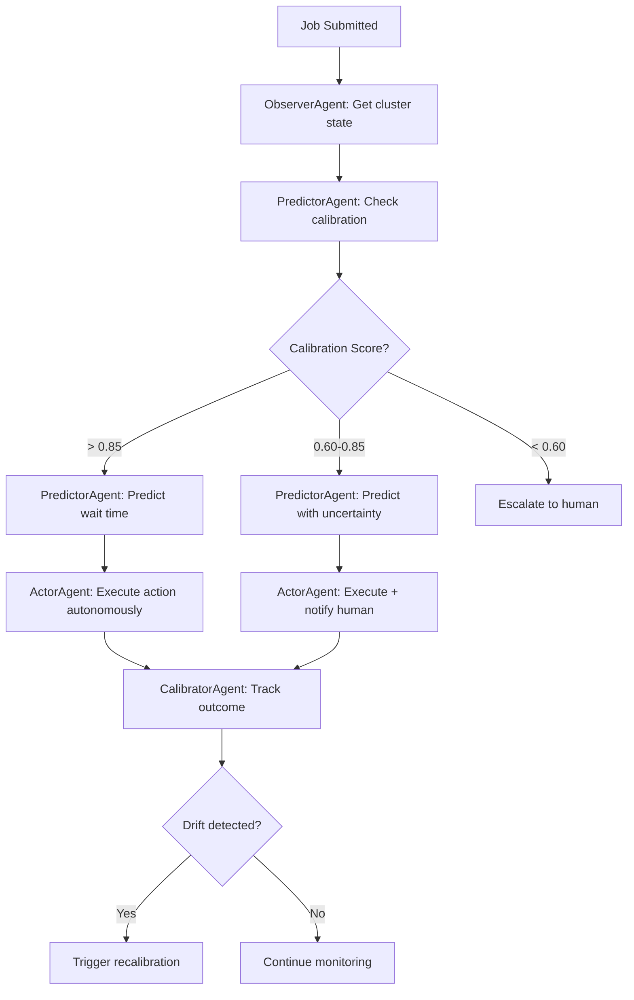

# VGAC Agentic Layer

An agentic intelligence layer for [VGAC](https://vgac.cloud) GPU observability platform.

**Competition:** AWS AIdeas 2026  
**Deadline:** March 13, 2026  
**Budget:** $200 AWS credits  
**Repository:** https://github.com/espirado/vgac-agenti

## The Problem

Most AI agents are equally confident everywhere—and wrong. They have no mechanism to detect when they're operating outside their training distribution.

**Real-world impact:** A prediction model trained on Kubernetes shows 22× calibration degradation when deployed on Slurm HPC clusters. The model still outputs confident predictions, but they're unreliable.

## Research Foundation

This work builds on empirical research in GPU queue prediction and calibration:

### Published Research
📄 **[Calibration Under Extreme Imbalance: A Multi-Cluster Benchmark for Operational Queue Delay Prediction](https://www.techrxiv.org/users/1021504/articles/1382525-calibration-under-extreme-imbalance-a-multi-cluster-benchmark-for-operational-queue-delay-prediction?commit=f538a3c4fb)**
- Demonstrates 22× calibration degradation across GPU schedulers
- Establishes ECE baseline of 0.018 for production models
- Multi-cluster benchmark across K8s, Slurm, AWS Batch

### In Progress
📝 **Paper 2: "Reliability-First Queue Risk Prediction for GPU Clusters"**
- Conference draft → Journal expansion (target ~1,300 lines)
- Evaluates 1.2M EKS jobs + 555 Slurm HPC jobs
- Defines 4-SLI framework: discrimination (AUROC/AUPRC), calibration (ECE/MCE), proper scoring (Brier), tail calibration

**Key Findings:**
- Feature richness > model complexity (LR with 23 features beats GB with 9)
- Discrimination ≠ calibration (RF: AUROC 0.991, ECE 0.068 - worst calibration)
- Cross-cluster asymmetry: AUROC degrades ~8%, ECE degrades 22×
- Gradient Boosting dominates calibration (ECE: 0.004, 0.002, 0.000)

📝 **Paper 3: "From Calibrated Probabilities to Scheduling Decisions"**
- Conference draft (~400 lines)
- Decision-theoretic bridge: Given calibrated probability p̂, what should the scheduler DO?
- Defines 4 graduated intervention tiers with calibration prerequisites:

| Tier | Action | Threshold | ECE Required |
|------|--------|-----------|--------------|
| 1 | Annotate (add risk label) | ≥ 0.3 | ≤ 0.10 |
| 2 | Warn (notify user) | ≥ 0.5 | ≤ 0.07 |
| 3 | Suggest (recommend reschedule) | ≥ 0.7 | ≤ 0.05 |
| 4 | Gate (block/require confirm) | ≥ 0.9 | ≤ 0.03 |

**Key Insight:** Honest tier qualification - A model with AUROC 0.756 but ECE 0.077 qualifies for Tiers 1-2 only. AUROC-only evaluation would miss this safety constraint entirely.

## Our Solution: Calibration-Aware Agents

VGAC agents implement **environment-aware calibration** that adapts autonomy based on prediction reliability:

### Core Innovation
1. **Per-Environment Calibration Tracking** - Monitor Expected Calibration Error (ECE) for each GPU scheduler (EKS, Slurm, Batch)
2. **Confidence-Gated Actions** - Reduce autonomy when calibration drifts (implements Paper 3's tier system)
3. **Drift Detection** - Trigger recalibration when accuracy degrades (22× threshold from Paper 1)
4. **Learning Mode** - Request human validation in unfamiliar environments

### Why This Matters
- Prevents autonomous agents from taking wrong actions with high confidence
- Detects distribution shift in production
- Maintains trust through transparency about uncertainty
- Scales to new environments safely

## Agent Workflow

### Scenario: New GPU Job Submitted



**Step-by-step:**
1. **ObserverAgent** monitors cluster state (queue depth, GPU utilization)
2. **PredictorAgent** checks calibration score for the cluster
3. **PredictorAgent** predicts wait time with confidence based on calibration
4. **ActorAgent** gates action execution based on confidence level
5. **CalibratorAgent** tracks prediction accuracy and detects drift
6. If drift detected, reduce autonomy and trigger recalibration

## Agents

| Agent | Purpose | Key Behavior | Tools |
|-------|---------|--------------|-------|
| **Observer** | Watch cluster state | Detect anomalies, provide situational awareness | `tool_get_cluster_state`<br>`tool_get_queue_depth`<br>`tool_detect_anomaly` |
| **Predictor** | Predict wait times | Calibration-aware confidence scoring | `tool_predict_wait_time`<br>`tool_get_calibration_score`<br>`tool_get_environment_profile` |
| **Actor** | Take actions | Gate actions by calibration confidence | `tool_send_slack_notification`<br>`tool_requeue_job`<br>`tool_adjust_priority`<br>`tool_escalate_to_human` |
| **Calibrator** | Monitor accuracy | Trigger recalibration when drift detected | `tool_check_calibration_drift`<br>`tool_trigger_recalibration`<br>`tool_update_environment_profile` |

## Key Features

### 1. Environment-Aware Calibration
- Track prediction accuracy per GPU environment (EKS, Slurm, Batch)
- Detect 22× calibration degradation across schedulers
- Maintain per-cluster calibration profiles

### 2. Confidence-Gated Actions
- **High confidence (>0.85)**: Autonomous action (Tier 4 from Paper 3)
- **Medium confidence (0.60-0.85)**: Act + notify human (Tiers 2-3)
- **Low confidence (<0.60)**: Escalate only, no autonomous action (Tier 1)

**Research basis:** Implements the graduated intervention framework from "From Calibrated Probabilities to Scheduling Decisions" with ECE-based tier qualification.

### 3. Drift Detection
- Monitor Expected Calibration Error (ECE) vs baseline (0.018)
- Trigger recalibration when drift exceeds 2× baseline
- Learning mode for new environments (<50 samples)

**Research basis:** ECE baseline and 22× degradation threshold from "Calibration Under Extreme Imbalance" multi-cluster benchmark.

### 4. Multi-Platform Support
- Kubernetes (EKS)
- Slurm HPC clusters
- AWS Batch
- Unified telemetry schema

## How It Works

### 1. Calibration Monitoring
```python
# CalibratorAgent continuously monitors prediction accuracy
calibration_state = await get_calibration_state("eks-prod-gpu")
# ECE: 0.018 (baseline) → 0.036 (2× drift detected)

drift = check_calibration_drift(current_ece=0.036, baseline_ece=0.018)
# drift_ratio: 2.0, action: "monitor"
```

### 2. Confidence-Gated Predictions
```python
# PredictorAgent checks calibration before predicting
prediction = await predictor.predict_with_calibration(
    job_id="gpu-job-123",
    cluster_id="eks-prod-gpu"
)

# If calibration < 0.60: Return "predictions unreliable"
# If calibration 0.60-0.85: Predict with uncertainty flag
# If calibration > 0.85: Predict with full confidence
```

### 3. Action Gating
```python
# ActorAgent gates actions based on calibration
result = await actor.execute_with_gating(
    cluster_id="eks-prod-gpu",
    action="tool_requeue_job",
    parameters={"job_id": "gpu-job-123", "target_queue": "low-priority"}
)

# Calibration > 0.85: Execute autonomously
# Calibration 0.60-0.85: Execute + notify human via Slack
# Calibration < 0.60: Escalate to human, don't execute
```

### 4. Drift Detection & Recalibration
```python
# When drift exceeds threshold, trigger recalibration
if drift_ratio > 2.0:
    await calibrator.invoke_tool(
        "tool_trigger_recalibration",
        {"cluster_id": "slurm-hpc-01", "reason": "ECE increased 2.1× from baseline"}
    )
    # Reduces agent autonomy until model is retrained
```

## Quick Start

### Prerequisites
- Python 3.11+
- VGAC platform running locally or accessible via API
- AWS account (for deployment)

### Installation

```bash
# Clone
git clone https://github.com/espirado/vgac-agenti.git
cd vgac-agenti

# Install dependencies
pip install -e ".[dev]"

# Configure environment
cp .env.example .env
# Edit .env with your settings:
#   - VGAC_API_BASE_URL (http://localhost:8000 for local)
#   - VGAC_PLATFORM_PATH (path to VGAC platform source)
#   - SLACK_WEBHOOK_URL (for notifications)
#   - AWS_REGION and DYNAMODB_TABLE_NAME
```

### Development

```bash
# Run tests
pytest

# Run with coverage
pytest --cov=src --cov-report=html

# Type checking
mypy src/

# Linting
ruff check src/
```

### Deployment

```bash
# Build SAM application
sam build

# Deploy to AWS
sam deploy --guided

# Or use AWS CDK (coming soon)
```

## Project Structure

```
vgac-agenti/
├── .kiro/                    # Kiro AI assistant configuration
│   ├── project.md            # Project context and overview
│   ├── rules/                # Code standards, AWS constraints, testing
│   │   ├── aws-constraints.md
│   │   ├── code-standards.md
│   │   └── testing.md
│   └── skills/               # Domain knowledge and patterns
│       ├── vgac-context.md   # VGAC platform API mapping
│       ├── agent-patterns.md # Agent design patterns
│       ├── calibration.md    # Calibration logic
│       └── integration.md    # Integration patterns
├── src/
│   └── agents/               # Agent implementations
│       ├── base.py           # Base agent class
│       ├── observer.py       # Cluster monitoring agent
│       ├── predictor.py      # Wait time prediction agent
│       ├── actor.py          # Action execution agent
│       └── calibrator.py     # Calibration monitoring agent
├── tests/
│   ├── conftest.py           # Pytest configuration
│   └── test_calibration.py  # Calibration tests
├── .env.example              # Environment template
├── .gitignore                # Git ignore rules
├── pyproject.toml            # Python project config
└── README.md                 # This file
```

### Coming Soon
- `src/tools/` - Tool definitions for Bedrock AgentCore
- `src/clients/` - VGAC, Slack, DynamoDB clients
- `lambdas/` - Lambda function handlers
- `infrastructure/` - SAM/CloudFormation templates

## Technology Stack & Tools

### Core Technologies
- **Python 3.11+** - Agent implementation
- **AWS Bedrock AgentCore** - Multi-agent orchestration
- **AWS Bedrock (Claude Haiku)** - Agent reasoning engine
- **AWS Lambda** - Serverless execution
- **AWS DynamoDB** - Calibration state persistence

### Development Tools
- **Kiro AI** - AI-powered development assistant
  - Automated code generation with context awareness
  - Built-in skills for VGAC platform integration
  - Agent pattern templates and best practices
- **Pytest** - Testing framework with async support
- **Ruff** - Fast Python linter and formatter
- **MyPy** - Static type checking for reliability

### Integration Points
- **VGAC Platform** - GPU observability and prediction engine
  - REST API for predictions, cluster state, calibration metrics
  - Production model: 0.801 AUROC, <10ms inference
- **Slack** - Human-in-the-loop notifications
- **Kubernetes** - Job scheduling and admission control

## Building with Kiro AI

This project was built using [Kiro](https://kiro.ai), an AI-powered development assistant. Kiro accelerated development through:

### 1. Context-Aware Code Generation
Kiro maintains project context in `.kiro/` directory:
- **Skills** - Domain knowledge (VGAC APIs, agent patterns, calibration logic)
- **Rules** - Code standards, AWS constraints, testing requirements
- **Project context** - Architecture decisions and design patterns

### 2. Automated Agent Scaffolding
```bash
# Kiro generated agent base classes with:
# - Tool definitions for Bedrock AgentCore
# - Async/await patterns for Lambda
# - Type hints and documentation
# - Test stubs with fixtures
```

### 3. VGAC Platform Integration
Kiro mapped the VGAC platform structure and generated:
- API client code with proper error handling
- Data models matching VGAC schemas
- Integration tests with mocked responses

### 4. Iterative Refinement
- Real-time code suggestions based on project patterns
- Automatic refactoring when patterns change
- Documentation generation from code

**Result:** Faster development with consistent code quality and comprehensive documentation.

## Development Status

### ✅ Completed
- [x] Agent architecture and base classes
- [x] Calibration logic with confidence gating
- [x] Drift detection algorithms
- [x] Kiro skills for VGAC platform integration
- [x] Project documentation and README
- [x] Test framework setup

### 🚧 In Progress
- [ ] VGAC API client implementation
- [ ] Bedrock AgentCore integration
- [ ] Tool definitions for each agent
- [ ] Lambda handlers and deployment infrastructure

### 📋 Planned
- [ ] Slack notification integration
- [ ] DynamoDB state management
- [ ] End-to-end integration tests
- [ ] Production deployment to AWS
- [ ] Monitoring and observability

## VGAC Platform Integration

This agentic layer wraps the existing VGAC platform via REST APIs:

**VGAC Platform Components:**
- **Prediction Engine** - `src/prediction/fast_predictor.py` (0.801 AUROC, <10ms)
- **Calibration System** - `models/production/safeguard_state.json` (ECE: 0.018)
- **Collectors** - `src/collectors/` (K8s, Slurm, AWS Batch)
- **Policy Generator** - `src/policy/generator.py` (0.6 confidence threshold)

**API Endpoints Used:**
- `POST /api/predict/wait` - Wait time predictions
- `GET /api/cluster/summary` - Cluster state
- `GET /api/jobs/queue` - Job queue status
- `GET /api/jobs/predict/calibration` - Calibration metrics

See `.kiro/skills/vgac-context.md` for complete API documentation.

## Contributing

This project is being developed for AWS AIdeas 2026 competition. Contributions welcome after initial submission.

## License

MIT

## Acknowledgments

- Built with [Kiro](https://kiro.ai) AI-powered development
- VGAC platform for GPU observability
- AWS Bedrock for agent orchestration
- Research foundation from multi-cluster calibration studies
